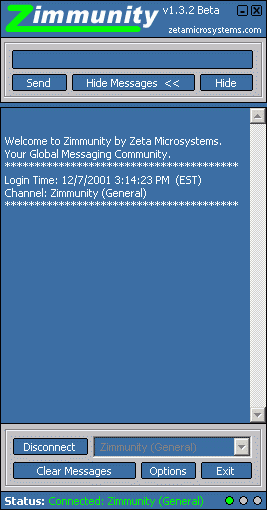



## Zimmunity Instant Messaging and Chat

### Description

Zimmunity is a global instant messaging or chat community which allows users to send messages or talk to a large group of other users without the use of usernames or password. This program kicks ass!! Its like a real-time message board!! It just needs to build up a good community of users. messenger, aol, icq, chat, message, talk, instant messenger, zimmunity!
 
### More Info
 

             |
---                |---
**Submitted On**   |2001-12-11 10:33:00
**By**             |[mdibai](https://github.com/Planet-Source-Code/PSCIndex/blob/master/ByAuthor/mdibai.md)
**Level**          |Advanced
**User Rating**    |4.3 (13 globes from 3 users)
**Compatibility**  |VB 6\.0
**Category**       |[Internet/ HTML](https://github.com/Planet-Source-Code/PSCIndex/blob/master/ByCategory/internet-html__1-34.md)
**World**          |[Visual Basic](https://github.com/Planet-Source-Code/PSCIndex/blob/master/ByWorld/visual-basic.md)
**Archive File**   |[Zimmunity\_4111712112001\.zip](https://github.com/Planet-Source-Code/mdibai-zimmunity-instant-messaging-and-chat__1-29667/archive/master.zip)

